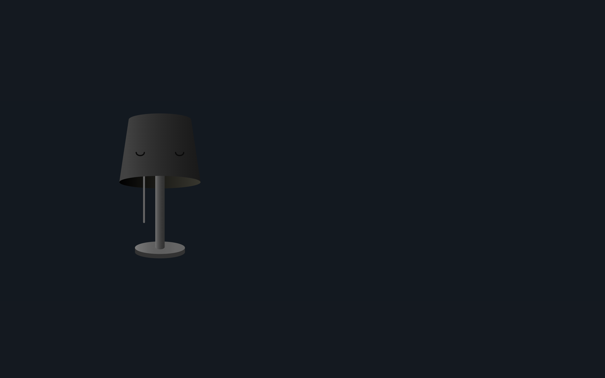

# 🌟 Luminous Quotes – Interactive Lamp & Quote Generator

[](https://lampquote.netlify.app/)
[](https://reactjs.org/)
[](LICENSE)

---

## 🎨 Overview

**Luminous Quotes** is a creative, interactive web application built with **React** and **GSAP**. Users can pull the lamp cord to toggle the lamp on/off, illuminating the page and revealing a new inspirational quote with a matching glow effect. The project demonstrates:

- Dynamic theming with **CSS variables**
- Smooth **GSAP animations**
- Interactive **drag-and-drop mechanics**
- Integration with a **Quote API**
- Twitter sharing for inspirational content

Live Project: [https://lampquote.netlify.app](https://lampquote.netlify.app)

---

## ✨ Features

- **Interactive Lamp:** Pull the lamp cord to toggle the lamp light.
- **Random Quotes:** Each toggle generates a new inspirational quote.
- **Dynamic Glow Colors:** Lamp and quote box adapt to a randomly generated color palette.
- **Share Quotes:** Post quotes directly on Twitter.
- **Responsive Design:** Works on desktop and mobile devices with smooth animations.

---

## 📸 Screenshots

**Lamp Off:**  


**Lamp On with Quote:**  


---

## 🛠️ Technologies Used

- **React** – Frontend library for building interactive UI
- **GSAP** – Advanced animations and interactive cord pulling
- **CSS Variables** – Dynamic theming for lamp and quote colors
- **Fetch API** – Retrieve random quotes
- **React Icons** – UI elements like quote marks and Twitter icon
- **Netlify** – Hosting and live deployment

---

## 🚀 Getting Started

### Clone the Repository

```bash
git clone https://github.com/IIKirito-kunII/lamp-quote.git
cd lamp-quote
```
